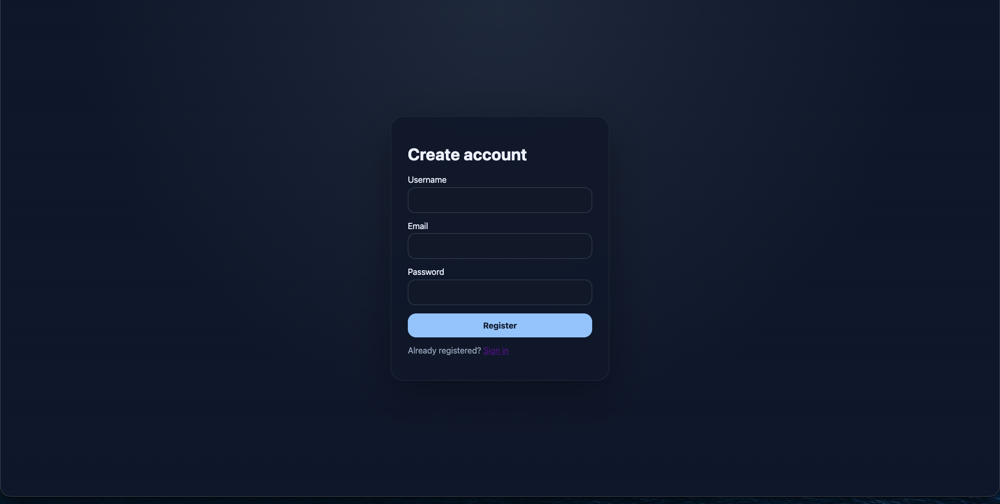
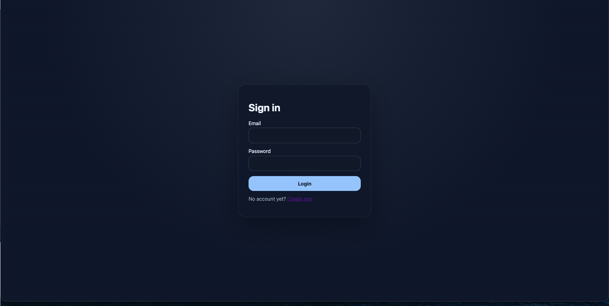
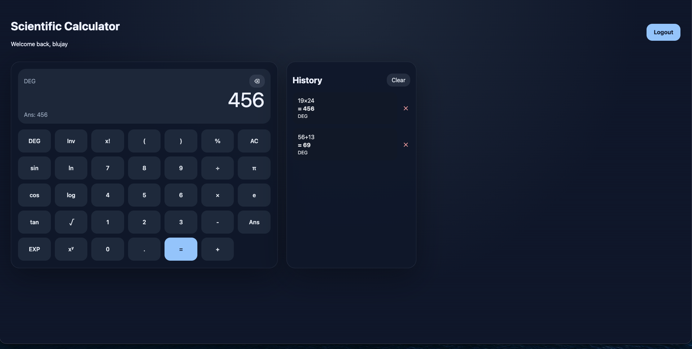

# Scientific Calculator App

A full-stack scientific calculator with authentication and per-user calculation history.

## Stack:

- **Frontend:** React + Vite
- **Backend:** Flask + Flask-JWT-Extended + Flask-SQLAlchemy
- **Database:** MySQL
- **Containerization:** Docker + Docker Compose
- **Math engine:** SymPy

## Features:

- Scientific calculator interface with backend-driven evaluation
- Degree / radian mode toggle
- Inverse trig toggle for `sin`, `cos`, and `tan`
- Scientific functions including:
  - `sin`, `cos`, `tan`
  - `asin`, `acos`, `atan`
  - `ln`, `log`
  - `sqrt`, factorial, exponentiation
  - constants `pi`, `e`, and `Ans`
  - `EXP` scientific notation input
- User registration and login
- JWT-based authentication
- Per-user saved calculation history in MySQL
- Dockerized frontend, backend, and database services
- Runtime frontend API configuration through `env-config.js`

## Project Structure:

```text
scicalc-app/
  backend/
    app/
      routes/
      __init__.py
      models.py
      services.py
    app.py
    Dockerfile
    requirements.txt
    schema.sql
    wait_for_db.py
    .env.example
  frontend/
    public/
      env-config.js
    src/
      components/
      context/
      pages/
    Dockerfile
    docker-entrypoint.sh
    index.html
    package.json
    vite.config.js
    .env.example
  docker-compose.yml
  .env.example
  README.md
```

## Docker Setup:

### 1. Create the root environment file

```bash
cp .env.example .env
```

Update the values in `.env` before starting the containers.

### 2. Build and start the app:

```bash
docker compose up --build
```

This starts three containers:

- **db** → MySQL database
- **backend** → Flask API
- **frontend** → production React build served by `serve`

### 3. Access the app:

- Application Link: `http://localhost:8080`

### 4. Stop the app:

```bash
docker compose down
```

To remove the database volume too:

```bash
docker compose down -v
```

## Environment Variables:

## Root `.env` used by Docker Compose

```env
MYSQL_ROOT_PASSWORD=change-please
MYSQL_DATABASE=scicalc_db
MYSQL_USER=scicalc_user
MYSQL_PASSWORD=change-please
SECRET_KEY=change-please
JWT_SECRET_KEY=change-please
BACKEND_PORT=5000
FLASK_ENV=production
CORS_ORIGINS=http://localhost:8080,http://127.0.0.1:8080,http://localhost:5173,http://127.0.0.1:5173
FRONTEND_PORT=8080
VITE_API_BASE_URL=http://localhost:5000/api
```

### How env handling works:

- The **db** service reads MySQL credentials from the root `.env`.
- The **backend** service receives its database connection string, Flask secrets, port, and CORS origins from Docker Compose.
- The **frontend** service receives `VITE_API_BASE_URL` from Docker Compose.
- At container startup, `frontend/docker-entrypoint.sh` writes that value into `dist/env-config.js`, so the frontend can pick up the API URL at runtime.
- The React app reads the API base URL in this order:
  1. `window.__APP_CONFIG__.VITE_API_BASE_URL`
  2. `import.meta.env.VITE_API_BASE_URL`
  3. fallback to `/api`

## API Endpoints:

### Auth:

- `POST /api/auth/register`
- `POST /api/auth/login`
- `GET /api/auth/me`

### Calculator:

- `POST /api/calculator/evaluate`

### History:

- `GET /api/history`
- `DELETE /api/history/<history_id>`
- `DELETE /api/history`

## Calculation Behavior:

- Expressions are evaluated on the backend with SymPy.
- In degree mode, trig functions accept degree input and inverse trig functions return degree output.
- `log(x)` is treated as base-10 logarithm.
- `ln(x)` is treated as natural logarithm.
- `%` is inserted as `/100` from the calculator UI.
- `EXP` is converted into `*10^` style scientific notation before evaluation.
- `Ans` is passed back to the backend as the previous result.

## Here are the web application images:






